# PROJECT Report

Author: Donna J. Harris (994042890) & Valter J. De Araujo Junior (195826730)

Date: Dec 20, 2022 

Check [readme.txt](readme.txt) for course work statement and self-evaluation. 
  
## Project Overview and Instructions (READ THIS SECTION FIRST)

### Introduction

The standard project report begins in the major section below, "R1 Requirements (project)".

In this section, we describe how to run and view different aspects of the project.

### Project Preparation, Deployment, and Execution Instructions

#### Pre-conditions:
- Apache is running.
- MySQL is running, with the same user and 'test' database as course assignments.
- JBoss is installed.

#### Important Notes:
- The build process uses a `create-drop` persistence strategy for entity beans. As a result, all tables will be dropped and created during deployment or undeployment.
- Please ignore the deployment errors regarding `ALTER TABLES` during the deployment, as they are related to the `create-drop` strategy.
- **To run the simulation again**, please re-deploy the application. The deployment will recreate all of the tables.

#### Summary of Steps
For complete details regarding these steps, please see below.

1. `standalone.bat -c standalone-full.xml`
2. `mvn clean package wildfly:deploy`
3. [http://localhost:8080/imad-web/imad-ui/dist/index.html](http://localhost:8080/imad-web/imad-ui/dist/index.html)
4. Check "A" Tables
5. [http://localhost:8080/imad-rs/rest/cardProcessing](http://localhost:8080/imad-rs/rest/cardProcessing)
6. Check "A" Tables again
7. [http://localhost:8080/imad-web/imad-ui/dist/index.html](http://localhost:8080/imad-web/imad-ui/dist/index.html)
8. Show deskop, iPad, iPhone form factors
9. `mvn wildfly:undeploy`
10. Check "T" and "A" Tables

#### Start JBoss web application server
From `C:\enterprise\workspace\project` run:

`standalone.bat -c standalone-full.xml`

#### Package the IMAD web application for use by JEE environment
From `C:\enterprise\workspace\project` run:

`mvn clean package`

#### Deploy the Web Application
To deploy the IMAD web application to JBoss, from `C:\enterprise\workspace\project` run:

`mvn wildfly:deploy`

#### View Base UI (with Mock Data)
To view the UI in its default state with ***mock*** data (present to confirm the UI is functional), go to:

[http://localhost:8080/imad-web/imad-ui/dist/index.html](http://localhost:8080/imad-web/imad-ui/dist/index.html)

**Note:** In order to see the IMAD app in action, the analytical data must be created from the raw transactional data.

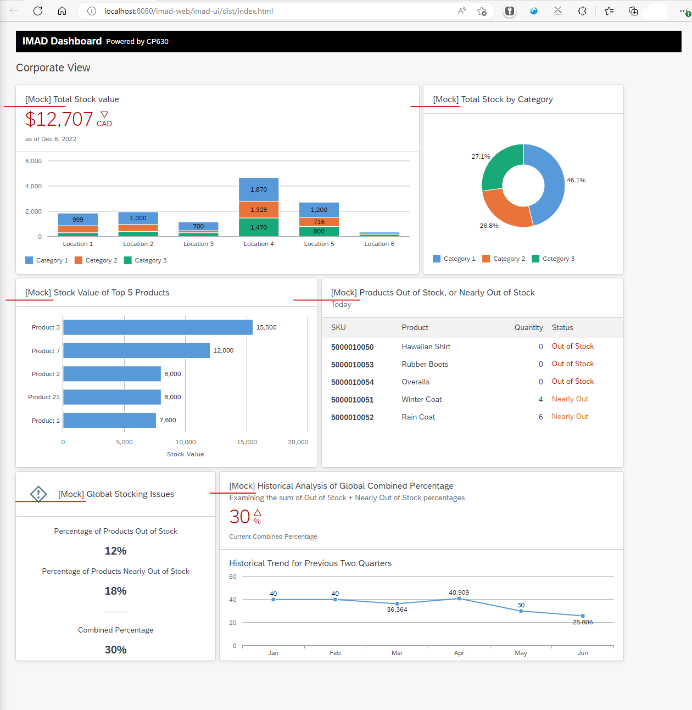{width=70%}

#### Generate Analytical Data
To generate the analytical data and populate the analytical tables go to:

[http://localhost:8080/imad-rs/rest/cardProcessing](http://localhost:8080/imad-rs/rest/cardProcessing)

This RESTful call returns a simple confirmation message data generation process has begun. The response looks like: `{"results": "process started"}`

The result of running this command is generating all of the analytical data and populating the Analytical tables with data.

> **NOTE:** Only run this data loading command ***ONE TIME*** in order to see the intended demonstration.

#### View the Analytical Data in Dashboard UI
To view the UI with the analytical data populated, refresh the UI index page, or go to:

[http://localhost:8080/imad-web/imad-ui/dist/index.html](http://localhost:8080/imad-web/imad-ui/dist/index.html)

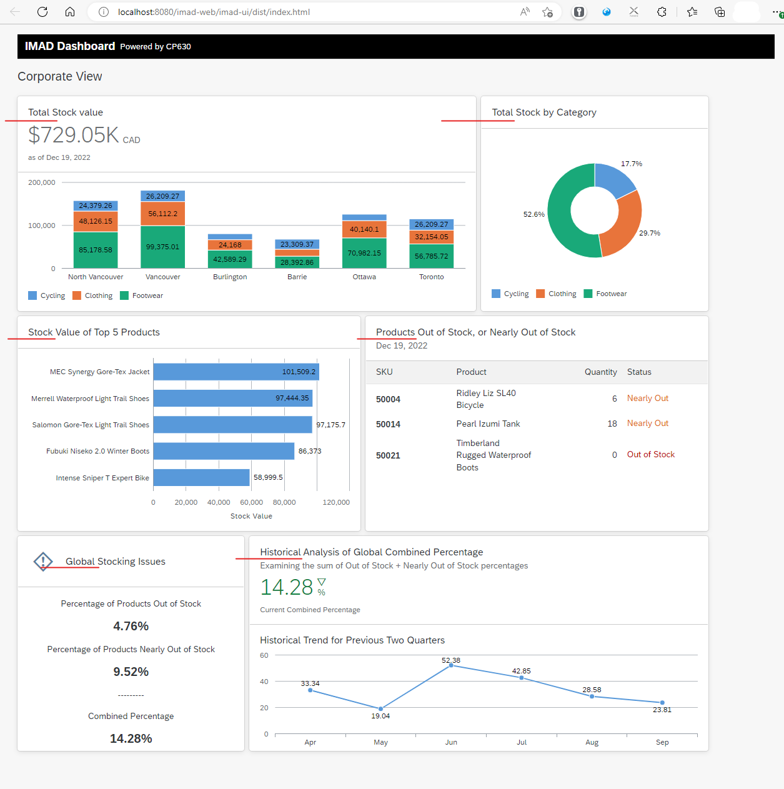{width=70%}

#### Call Individual REST Service Calls (Test Page)
To view and call the direct service calls used by the various cards on the dashboard, go to:

[http://localhost:8080/imad-rs/](http://localhost:8080/imad-rs/)

Clicking on each button will open a new browser window and show the JSON response to the RESTful web service call. Note, these are the calls made and the data consumed directly by the IMAD dashboard UI. The results seen in these calls are the results presented on the dashboard.
  
#### Undeploy the Web Application
To undeploy the IMAD web application, from `C:\enterprise\workspace\project` run:

`mvn wildfly:undeploy`

  
## R1 Requirements (project)

### R1 Write a project proposal (2-3 pages).

Complete? Yes

#### R1 Overview

In November, we proposed an Inventory Management Analytics Dashboard (IMAD) application which presents
a high-level, no-input view of inventory.

IMAD presents details that will detect trends, issues, and opportunities with respect to product stock levels. The application transforms raw transactional data into analytical information and presents its analysis in a modern user interface. The IMAD dashboard consumes the analytical data using RESTful web services.

### R2 Design data format, collect data, create dataset for the application.

 
Complete? Yes

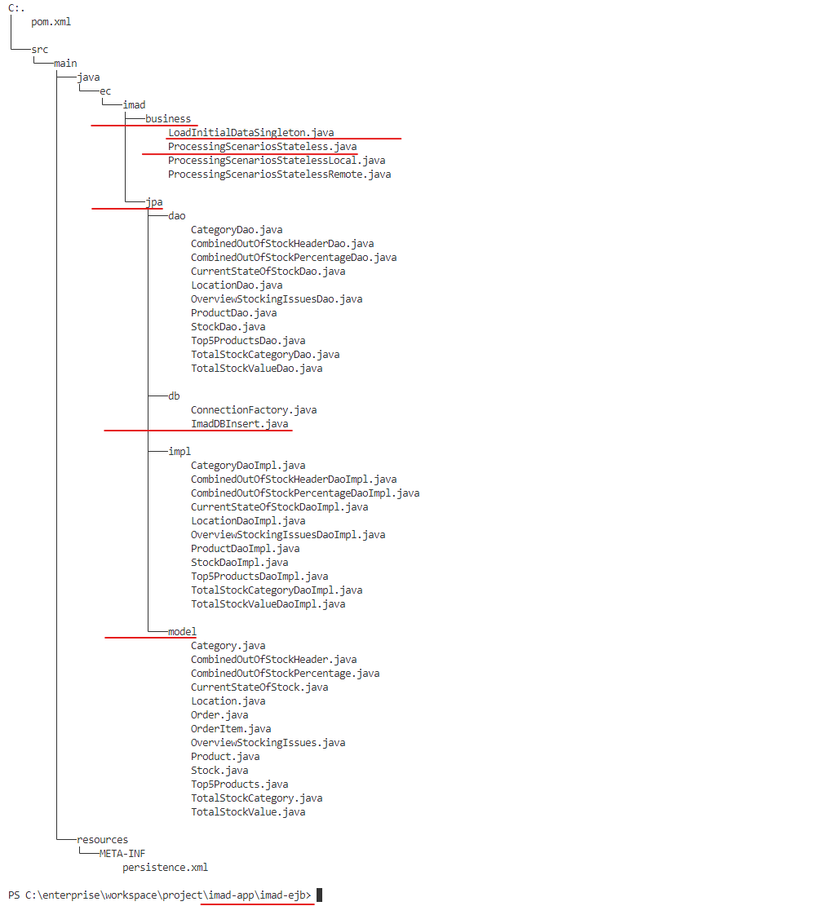{width=90%}

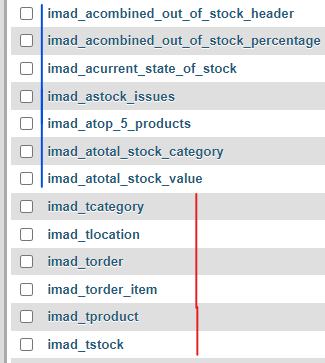{width=40%}

{width=90%}

#### R2 Overview
IMAD is a data-centric application. The approach to use transactional and analytical data simulates systems with multiple databases. This application makes a logical separation between these kinds of data by using two different types of tables.

Transactional data tables (also known as "T tables", with the prefix `IMAD_T`) contain the raw data that would be generated in the day-to-day operations of an organization. This version of the application focuses on products, stocking levels (both current and historical), product categories, and stock locations.

Analytical data tables (also known as "A tables", with the prefix `IMAD_A`) start off empty when the application is deployed. These tables are the end result of the ETL process, providing the data directly consumed by the dashboard.

In the current version, a card processing RESTful call generates all of the Analytical data based on the Transactional data. Note that in a future version, these tables would be updated regularly to reflect changes in the Transactional data.

Both kinds of tables are modeled by entity beans.

We used the `@Startup` annotation in the singleton bean which loads the initial Transactional data.

The product, category, and location data was extracted from the MEC.ca website. Data around stock levels and reorder points were manually generated for demonstration purposes.

We used a shared spreadsheet to manage and generate intentional Transactional data, which is loaded from `ImadDBInsert.java` in the `db` package. This information helped to test and inform the correctness of the analysis.

### R3 Develop and implement data application algorithms for the proposed application problem.

 
Complete? Yes

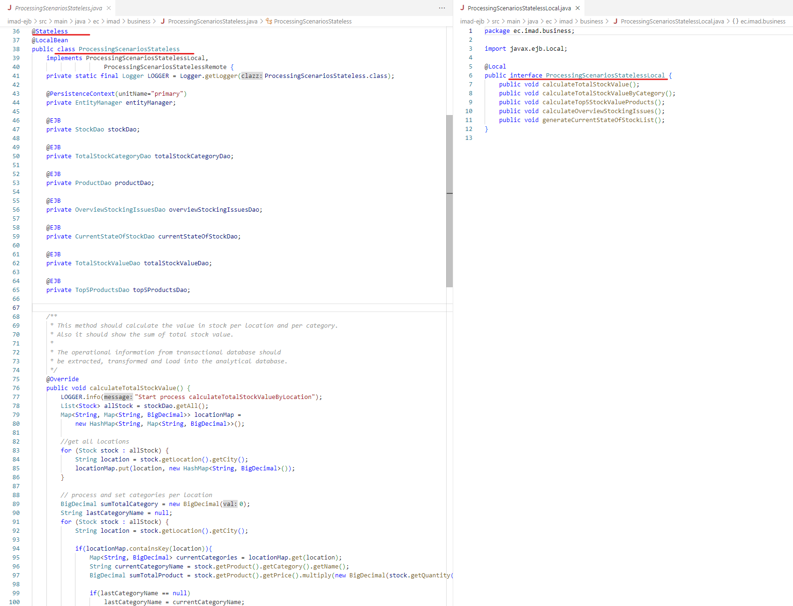{width=90%}

#### R3 Overview

The `business` layer uses a stateless session bean containing all of the business logic for generating the Analytical data from the Transactional data. (This is triggered by the CardProcessing RESTful service call.)

This layer is the heart of the dashboard. Without it, analysis could not be presented to the user for their consideration. These algorithms handle the Extract and Transform aspects of the ETL process, acquiring and manipulating the Transactional data into something meaningful.

Each card on the UI has a method for generating analytical data, found in 
`ProcessingScenariosStatelessLocal.java`.

#### calculateTotalStockValue
Shows the total value of all stock currently in the organization. Also presents a breakdown of the stock value currently at each location, and further broken down by category.

#### calculateTotalStockValueByCategory
Shows the organizational view of what percentage of stock belongs to what product category.

#### calculateTop5StockValueProducts
Shows the five products with the highest stock value currently in the organization.

#### generateCurrentStateOfStockList
Shows a list of products that are completely out of stock, or are below the reorder point for that product (Nearly Out), across the entire organization.

#### calculateOverviewStockingIssues
Shows a global percentage of products that are out of stock, or below their reorder point. The combined percentage is the sum of the two percentages and can be used here to indicate an overall state of understocking in the organization.

(Note: these percentages are a naive metric used for the purposes of this project.)

#### calculateCombinedPercentageHistory
Shows a historical trend of the combined percentage (described above) across the previous two quarters. It also shows the current combined percentage (note: it will present the same value as in the stocking issues card) and the trend compared to the last month in the previous quarter. If the current percentage is larger, it warns of a potential problem of increasing stocking issues. If it is lower, it depicts an improving situation.

(Note: these percentages are a naive metric used for the purposes of this project.)

### R4 Do data computing to generate models, representing models in portable format and stored in file or database. More credit is given if distributed approach is used data mining of big dataset.

 
Complete? Yes

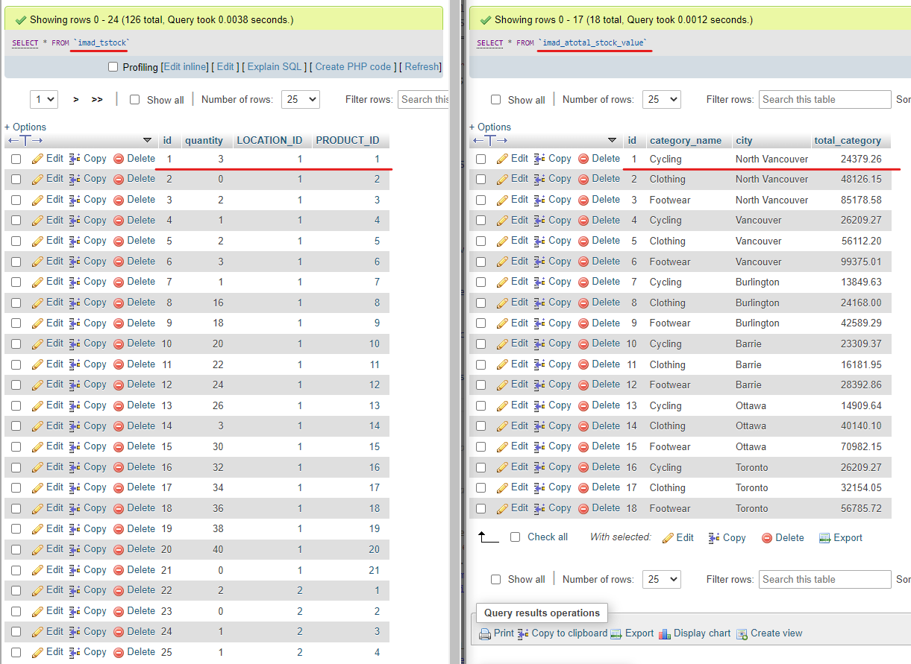{width=90%}

#### R4 Overview

The algorithms described in the **R3 Overview** perform the transformation of Transactional data and store the results to Analytical data tables that are ready to be consumed. The EJB code of the business layer takes on the burden of the data processing here.

As seen in the figure above, and mentioned previously in R2, the Analytical tables are the end result of the ETL processing. The data in the table on the right (an Analytical table) is user-friendly compared to the Transactional data. The transformed data is ready to consume by other code, such as a web service. 

The advantage of this approach is the cost reduction of having to constantly make complex calls or load large amounts of data. Instead, the user can see the analytical snapshot from the moment in time and benefit from the analysis without unnecessary delays or demands on the system. This would be particularly important with big data.

### R5 Create deployable service components using application models using Java based enterprise computing technologies, to create client program to do remote call of the data mining services.

 
Complete? Yes

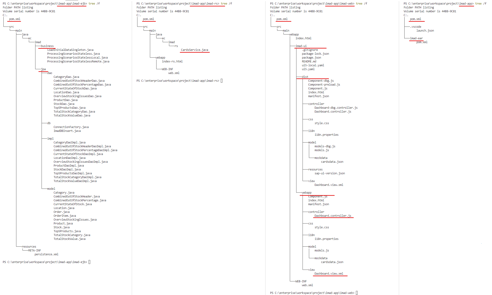{width=90%}

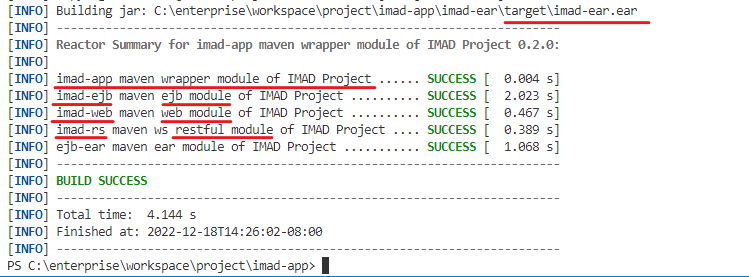{width=70%}

#### R5 Overview

The IMAD application is well-layered, following the separation of concerns design pattern. The persistence layer (`imad-ejb`, `jpa`), business logic (`imad-ejb`, `business`), web services (`imad-rs`), and web interface (`imad-web`) are all packageable as `imad-app` wrapper.

We used maven to manage the build process and to make it easy to deploy the package to any JEE application, not just this project.

The UI is also prepared for a production-ready environment (see **R8 Overview**) using `npm`. 

### R6 Deploy service components onto enterprise application servers.

 
Complete? Yes

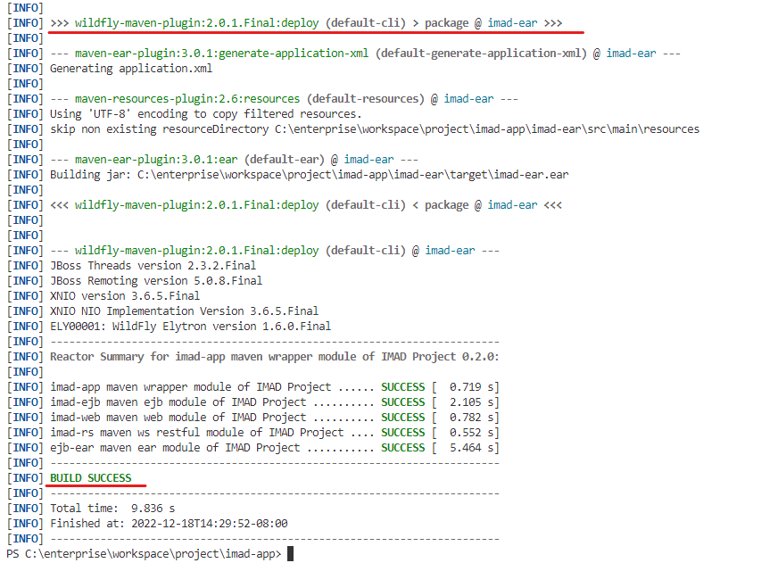{width=70%}

{width=90%}

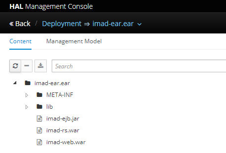{width=60%}

#### R6 Overview

Using the `mvn wildfly:deploy` command, the application is successfully deployed to the JBoss web server (locally hosted). The log and console views show the `.ear` package deployed.

### R7 Create web services (SOAP, RESTful) to use the data service components.

 
Complete? Yes

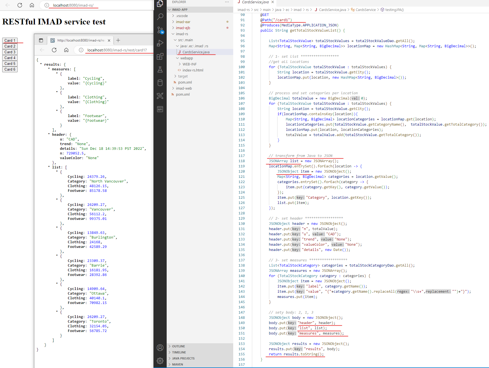{width=90%}

#### R7 Overview

The conscious decision was made to use RESTful web services to support the dashboard interface. This was a result of using the chosen user interface library, SAPUI5. (See **R8 Overview**.) SAPUI5 is designed to be used with RESTful web services and supports those best.

The RESTful calls used by the UI can be called directly from a services test page: [http://localhost:8080/imad-rs/](http://localhost:8080/imad-rs/). All of the web services return a JSON response. The most complex cards leverage a JSON library, `JSON-Java` (`org.json`). (See: [https://www.baeldung.com/java-org-json](https://www.baeldung.com/java-org-json).) The `JSONObject` provides a more friendly way to work with JSON data in Java over directly building and manipulating `String` data.

The calls are made from the `webapp` JavaScript dashboard and the response is consumed and presented in the UI.

### R8 Create web user interface/mobile applications to use the application/web services.

 
Complete? Yes

{width=70%}

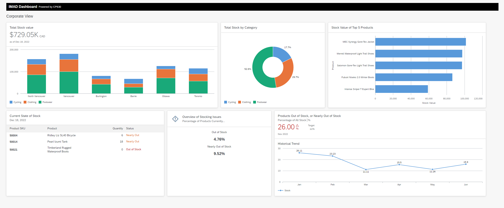{width=90%}

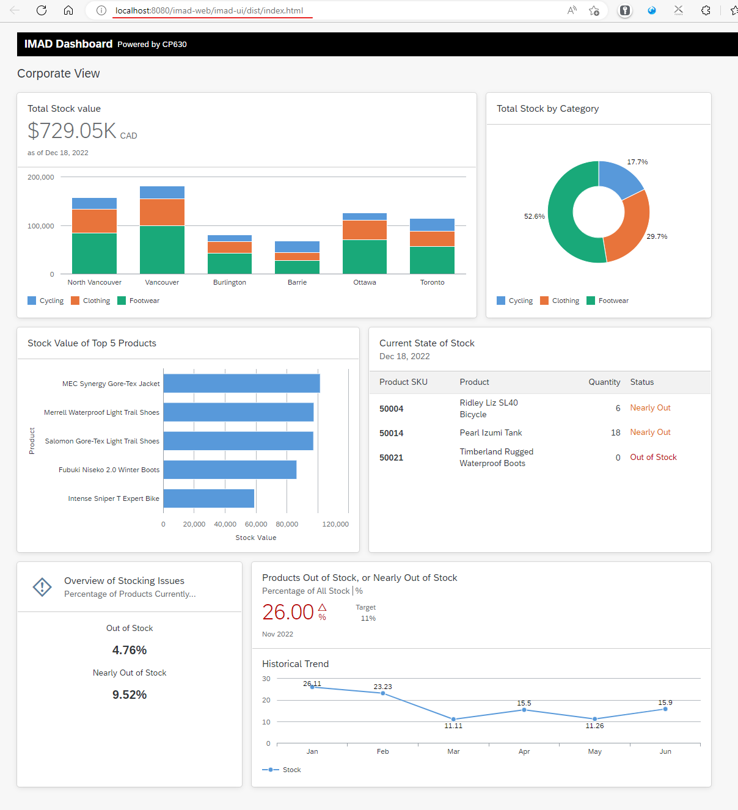{width=80%}

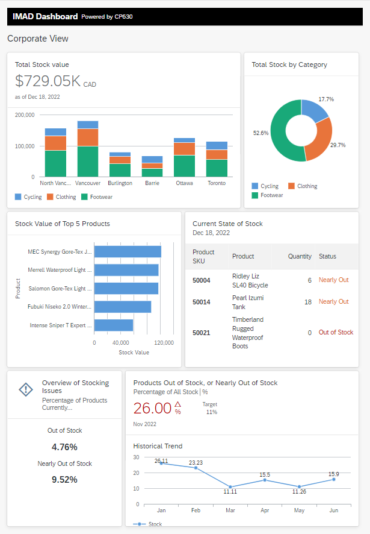{width=40%}

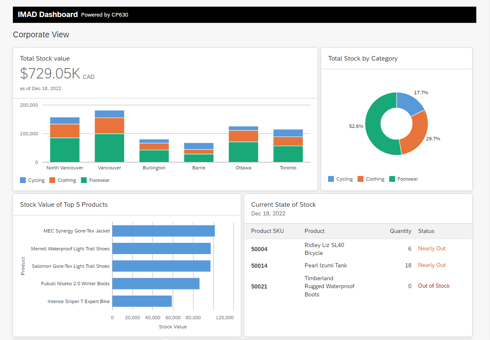{width=60%}

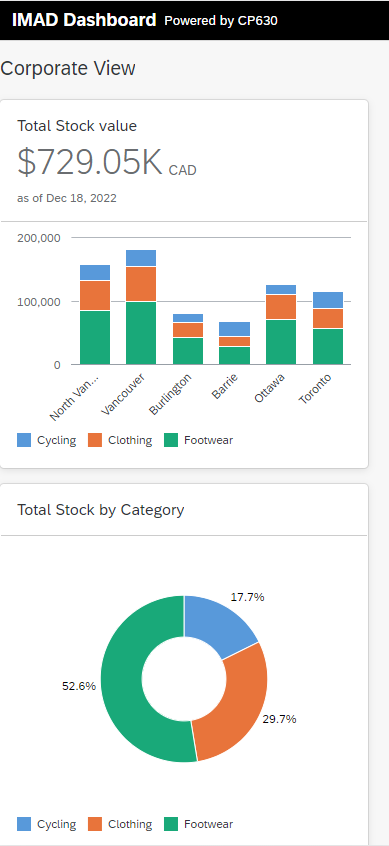{width=30%}

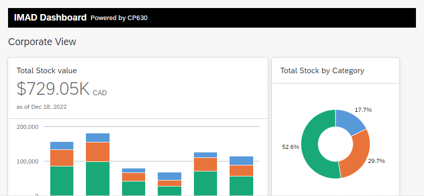{width=50%}

#### R8 Overview

The IMAD user interface is built using the professional framework SAPUI5. (Reference: [https://sapui5.hana.ondemand.com/](https://sapui5.hana.ondemand.com/) Leveraging this powerful UI library allowed us to build cards that were meaningful and attractive with a minimum of development work. The cards in the framework themselves are JSON-based. As a result, this informed much of the data modeling and web services work for the Analytical data.

From the user's perspective, this is the end point of the ETL process, where the prepared analytical data is loaded into a visual UI.

The SAPUI5 library was built on responsive design principles, allowing the IMAD web application to be easily viewed using any viewport size or orientation, including desktop, tablet, and mobile phone.

From a development perspective, the UI follows MVC principles, with a controller for the dashboard which is driven by the model data and is presented (again on the dashboard) in the various card views.

The website itself is built to be production-ready, using `npm` and its build process, which minifies the code for the most efficient loading. The default view of the project website uses this minified code.

### R9 Test your services, log your services, and document your term project.

 
Complete? Yes

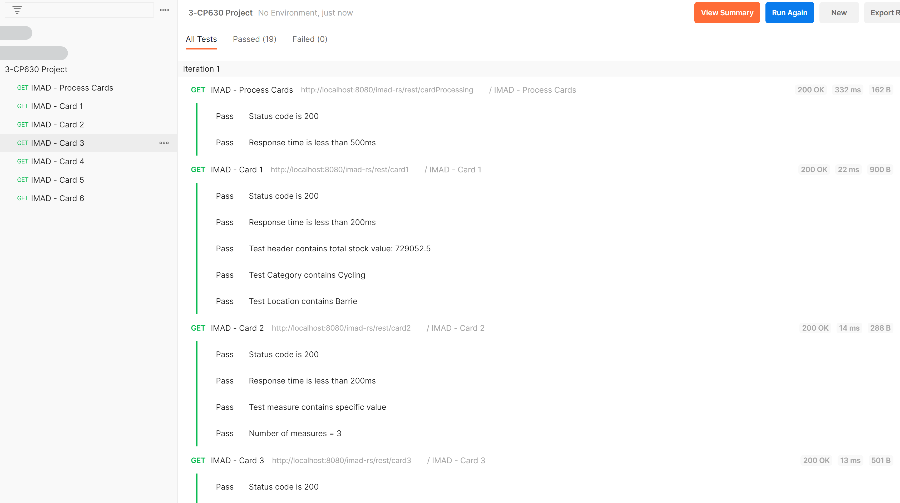{width=90%} 

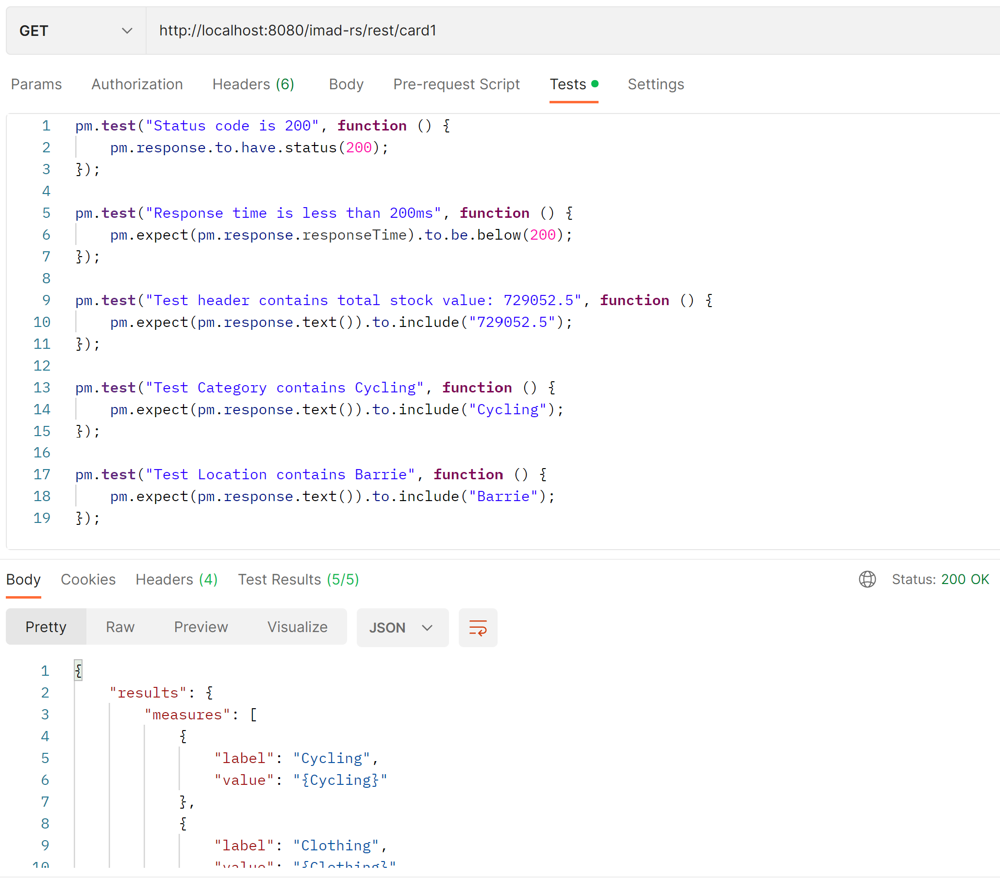{width=90%} 

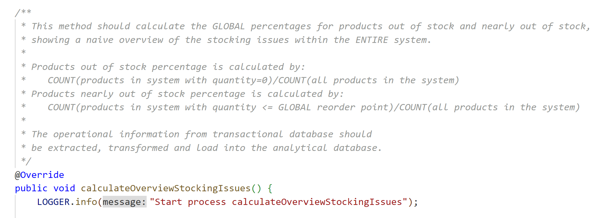{width=90%} 

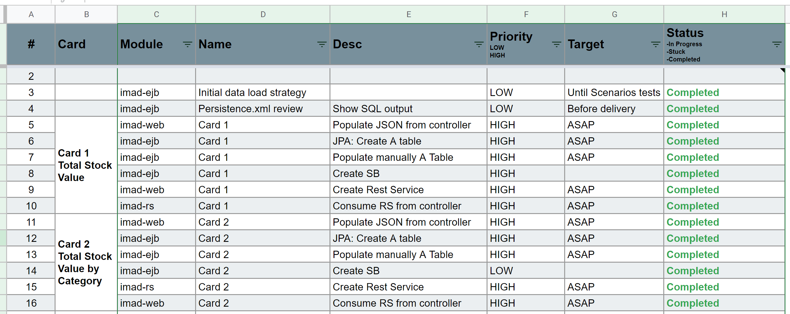{width=90%} 

#### R9 Overview

Our services were manually tested using our generated data (as discussed at the end of **R2 Overview**) to determine the expected results of the analysis. In this way, we were able to confirm that each business requirement was tested for all cards.

The imad-rs test page includes direct links to all service calls needed for the application to load the Analytical data.

Additionally, the services were verified using automated Postman tests. These are located in the project folder `C:\enterprise\workspace\project\tests`, and can be imported into Postman to run.

All called services are logged by the JBoss logger and important methods and key steps are documented throughout the project code.

### R10 Demonstrate your term project in final project presentation, slides, short video.
 
Complete? (Yes/No) 

#### R10 Overview

Our CP630 final project demonstration video can be accessed at: 

This video shows ... highlights ... etc...

**References**

1. CP630OC project
2. CP630OC Assignment 3
3. [https://news.sap.com/2022/10/sap-nhl-develop-nhl-venue-metrics/](https://news.sap.com/2022/10/sap-nhl-develop-nhl-venue-metrics/)
4. [https://www.baeldung.com/java-org-json](https://www.baeldung.com/java-org-json)
5. [https://sapui5.hana.ondemand.com/](https://sapui5.hana.ondemand.com/)
6. [https://www.mec.ca/en](https://www.mec.ca/en)